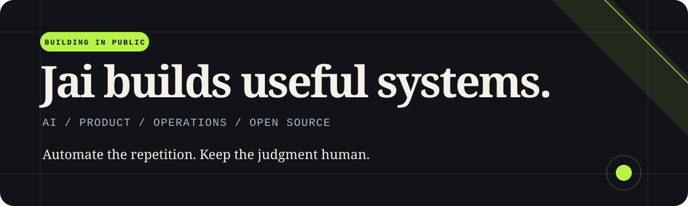
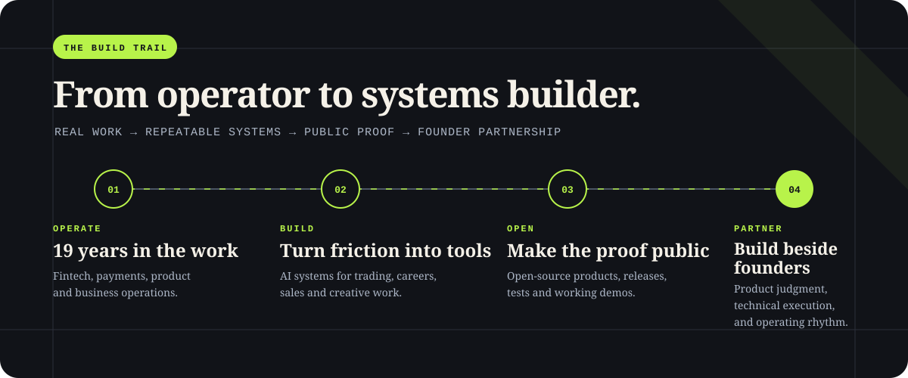

  

  
  
  

I turn awkward, repetitive work into small systems people can inspect and run themselves. My work
sits across AI-assisted workflows, developer tooling, PostgreSQL safety, and self-serve products.
The common thread is simple: automate the repetition, keep consequential decisions with the user.

## The build trail

  

The repositories below are not a collection of disconnected experiments. They trace one operating
idea: start with work I understand firsthand, turn the repeated parts into a system, and publish
enough evidence for someone else to inspect the claim. Today I bring that same loop into founder
teams as a fractional AI co-founder.

## Building now

<table>
  <tr>
    <td width="50%" valign="top">
      <h3><a href="https://github.com/eyeinthesky6/indexpilot">IndexPilot</a></h3>
      
<strong>Stop bad PostgreSQL indexes before production.</strong>

      
A read-only evidence check for the exact <code>CREATE INDEX</code> a team wants to merge. It compares the proposal with workload signals and existing indexes without applying the migration.

      

        <a href="https://eyeinthesky6.github.io/indexpilot/">Website</a> ·
        <a href="https://github.com/eyeinthesky6/indexpilot">Source</a> ·
        <a href="https://github.com/eyeinthesky6/indexpilot/releases">Releases</a>
      

      
    </td>
    <td width="50%" valign="top">
      <h3><a href="https://github.com/eyeinthesky6/codex-coordinator">Codex Coordinator</a></h3>
      
<strong>Keep parallel Codex tasks from colliding.</strong>

      
A repository-native coordination layer that records ownership, handoffs, blockers, and resumable state without requiring another hosted service.

      

        <a href="https://eyeinthesky6.github.io/codex-coordinator/">Website</a> ·
        <a href="https://github.com/eyeinthesky6/codex-coordinator">Source</a> ·
        <a href="https://github.com/eyeinthesky6/codex-coordinator/releases">Releases</a>
      

      
    </td>
  </tr>
  <tr>
    <td width="50%" valign="top">
      <h3><a href="https://github.com/eyeinthesky6/applycue">ApplyCue</a></h3>
      
<strong>Let an agent handle job-search repetition, not your decisions.</strong>

      
ApplyCue reviews approved sources and full job descriptions, prepares truthful role-specific material, and applies only with named permission.

      

        <a href="https://github.com/eyeinthesky6/applycue">Source</a> ·
        <a href="https://github.com/eyeinthesky6/applycue/releases">Releases</a>
      

      
    </td>
    <td width="50%" valign="top">
      <h3><a href="https://github.com/eyeinthesky6/artistpass">ArtistPass</a></h3>
      
<strong>One polished link for an artist's working identity.</strong>

      
An open-source portfolio template for showreels, headshots, casting details, resumes, contact flows, and browser-based publishing without a heavy CMS.

      

        <a href="https://eyeinthesky6.github.io/artistpass/">Project site</a> ·
        <a href="https://artistpass.vercel.app">Live demo</a> ·
        <a href="https://github.com/eyeinthesky6/artistpass/releases">Releases</a>
      

      
    </td>
  </tr>
</table>

<a href="https://github.com/eyeinthesky6?tab=repositories"><strong>Browse every public repository →</strong></a>

## How I work

| 01 — Find the friction | 02 — Keep the boundary | 03 — Ship the proof |
|---|---|---|
| Start from a real workflow that is wasting time or hiding a decision. | Automate repeated work while leaving high-impact choices with a person. | Make the claim checkable through public code, docs, tests, demos, and releases. |

## Current toolkit

  
  
  
  
  

AI / Product / Operations · 19 years across fintech, payments, and startups · building in public from India
